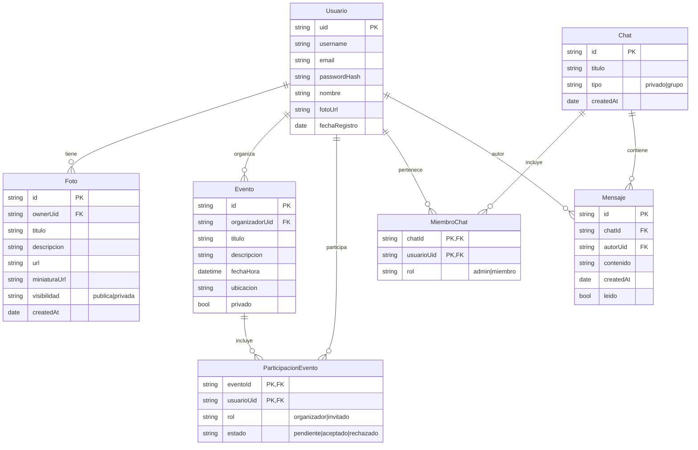

# Memories+

Aplicación prototipo tipo red social de recuerdos (*Memories+*), desarrollada para la **Práctica 1 – Parte I** de ADI.  
La app permite a los usuarios registrarse, subir fotos, crear eventos, y comunicarse mediante chats.

---

## 📌 Idea principal

Memories+ es una plataforma donde los usuarios pueden:

- Autenticarse (registro/login).
- Subir y gestionar fotos.
- Crear y participar en eventos.
- Comunicarse en chats privados o de grupo.
- Consultar su perfil.

---

## 🎯 Casos de uso principales

1. **Usuario** se registra e inicia sesión.  
2. **Usuario** sube una foto y gestiona sus imágenes.  
3. **Usuario** crea un evento e invita a otros.  
4. **Usuario** participa en un evento creado por otro.  
5. **Usuario** abre un chat (individual o grupal) y envía mensajes.  
6. **Usuario** edita su perfil (nombre, foto).  

---

## 🗄️ Modelo de datos (Memories+)

El siguiente diagrama muestra las entidades principales de la aplicación y sus relaciones.




## ⚙️ Backend (Parte II – ADI)

El backend de **Memories+** se implementa con **PocketBase** como BaaS (Backend as a Service) y una **capa de servicios en Node.js** que actúa como interfaz entre el frontend y la base de datos.  
Esta capa encapsula el SDK de PocketBase para ofrecer funciones de alto nivel (estilo RPC) sin exponer detalles internos.

### 🔗 Estructura del proyecto

```
ADI/
 ├── backend/              # Capa de servicios y scripts de prueba
 │   ├── services/
 │   │   ├── auth.service.js       # Autenticación y gestión de usuarios
 │   │   ├── events.service.js     # CRUD de eventos
 │   │   ├── photos.service.js     # CRUD de fotos
 │   │   ├── users.service.js      # Operaciones de perfil
 │   │   └── pb.js                 # Singleton PocketBase
 │   ├── scripts/                  # Scripts de prueba (ver abajo)
 │   ├── package.json
 │   └── package-lock.json
 ├── pocketbase/           # Migraciones, hooks y binario de PocketBase
 │   ├── pb_migrations/    # Estructura de colecciones (events, photos, contact_messages)
 │   ├── pb_hooks/         # Hooks (autoasignación de usuario, envío de emails)
 │   └── pocketbase        # Binario ejecutable
 └── web/                  # Frontend + servicios cliente + Jest tests
     ├── assets/js/services/
     ├── css/
     ├── *.html
     └── jest.config.js
```

---

## 🧩 Capa de servicios (Node.js)

Las funciones implementadas en `backend/services` proporcionan los casos de uso requeridos:

| Servicio | Funcionalidad principal |
|-----------|------------------------|
| **`auth.service.js`** | Registro, login/logout, usuario actual, restablecimiento de contraseña |
| **`events.service.js`** | CRUD completo de eventos, búsqueda por texto, paginación |
| **`photos.service.js`** | CRUD de fotos con soporte para archivos (`FormData`) |
| **`users.service.js`** | Lectura y actualización de perfil de usuario |
| **`pb.js`** | Singleton de PocketBase compartido entre todos los servicios |

Ejemplo de uso interno:
```js
import { login } from './services/auth.service.js';
import { createEvent } from './services/events.service.js';

await login("usuario@example.com", "123456");
await createEvent({ title: "Demo", location: "Alicante" });
```

---

## 🧪 Scripts de prueba

Dentro de `backend/scripts` se incluyen pequeños programas de prueba que permiten ejecutar operaciones del backend desde Node.js sin depender del frontend.  
Estos scripts sirven para verificar el correcto funcionamiento del CRUD y la autenticación.

| Script | Descripción |
|--------|--------------|
| **`create_events.js`** | Crea un evento de prueba (título, fecha, ubicación, descripción). |
| **`create_events_with_cover.js`** | Igual que el anterior, pero añade una imagen de portada (`cover`). |
| **`list_events.js`** | Lista eventos con paginación (`getList(page, perPage)`). |
| **`search_events.js`** | Busca eventos por texto (título o descripción). |
| **`update_events.js`** | Actualiza un evento existente. |
| **`delete_events.js`** | Elimina un evento por ID. |

**Ejemplo de ejecución:**
```bash
cd backend
node scripts/create_events.js
node scripts/search_events.js "Demo"
node scripts/update_events.js <id>
node scripts/delete_events.js <id>
```

> 🔸 Estos scripts **no forman parte del backend en producción**, pero son útiles para demostraciones y validación de la capa de servicios.

---

## 🧾 PocketBase (Base de datos y lógica)

- **Colecciones:** `users`, `events`, `photos`, `contact_messages`.  
- **Hooks:**  
  - Asignación automática del usuario autenticado al crear un `event`.  
  - Envío automático de correos de confirmación en `contact_messages`.  
- **Reglas de acceso:**  
  - Solo el propietario puede borrar o modificar sus fotos/eventos.  
  - Lectura pública permitida para ciertos recursos.

---

## 🧠 Pruebas unitarias

El frontend incluye una **suite de tests con Jest** para validar los servicios cliente.

Ubicación:
```
web/assets/js/services/tests/
```

Ejemplo de ejecución:
```bash
cd web
npm install
npm test
```

Estas pruebas cubren funciones como:
- `login()` y `registerUser()` (autenticación)
- `listPhotos()` y `uploadPhoto()` (fotos)
- `searchEvents()` y `listEvents()` (eventos)
- `updateMe()` (usuario)
- `sendContactMessage()` (contacto)

---

## 📤 Despliegue y ejecución

1. **Iniciar PocketBase**
   ```bash
   cd pocketbase
   ./pocketbase serve
   ```
2. **Probar el backend desde Node**
   ```bash
   cd backend
   npm install
   node scripts/create_events.js
   # No es necesario ejecutarlo ya, es simplemente para 
   # ver como se hizo en un primer momento mediante scripts.
   ```
3. **Ejecutar tests de prueba**
   ```bash
   cd web
   npm install
   npm test
   ```
